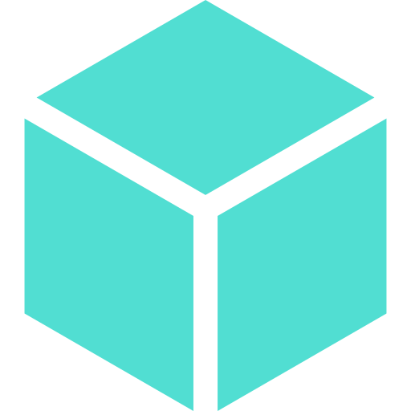

     
      
     
    <h1>CryptoBricks</h1>
     
     

A little game that interacts with Ethereum network. Developed for a school project.

## Getting started
- [Ethereum resources](https://ethereum.org/developers/#getting-started)
- [Debugging smart contracts](https://www.trufflesuite.com/tutorials/debugging-a-smart-contract)

## Scripts

- `yarn install` - install dependencies
- `yarn start` - run app in the browser
- `yarn build` - build app for production

## Attributions
- [Cryptocurrency icons](https://github.com/reddavis/Crypto-Icons-API)
- [Animated icons](https://react.useanimations.com/)
- Icons made by <a href="https://www.flaticon.com/authors/prettycons" title="prettycons">prettycons</a> from <a href="https://www.flaticon.com/" title="Flaticon"> www.flaticon.com</a>
